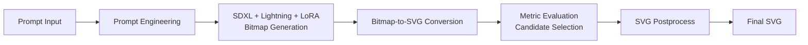

# Drawing with LLMs

This repository presents a production-style refactor of a Kaggle **Drawing with LLMs** competition solution.

It converts natural language prompts into structured SVG vector graphics through a multi-stage pipeline combining diffusion-based image generation and bitmap-to-SVG vectorization.

The project preserves the original Kaggle notebook while restructuring the code into a clean, modular Python project designed for reproducibility, experimentation, and future extension.

## 🏠 Kaggle Competition: Drawing with LLMs

- Final Score: **0.67953**
- Rank: **Top 4.66%**

## Project Goal

Convert natural-language prompts into constrained, high-quality SVG vector graphics through:

1. Prompt engineering (prefix/suffix/negative prompt)
2. SDXL + Lightning + LoRA bitmap generation
3. Layered bitmap-to-SVG conversion with size control
4. Candidate scoring and best-result selection
5. Final SVG post-processing for submission

## Key Highlights

- **Generation optimization:** SDXL + Lightning UNet for fast inference + vector-oriented LoRA
- **Conversion optimization:** KMeans quantization, contour extraction, importance sorting, polygon simplification
- **Constraint-aware output:** maximizes visual fidelity under strict SVG byte limits
- **Engineering refactor:** notebook logic split into maintainable modules and runnable scripts
- **Kaggle-ready interface:** preserves `Model` submission entry and supports batch workflows

## Pipeline



## Project Structure

```text
drawing-with-llms/
├── README.md
├── requirements.txt
├── .gitignore
├── notebooks/
│   └── sdxl-lora-original.ipynb
├── src/
│   └── drawing_llms/
│       ├── __init__.py
│       ├── config.py
│       ├── metrics.py
│       ├── evaluators.py
│       ├── model_loader.py
│       ├── bitmap_generator.py
│       ├── svg_converter.py
│       ├── pipeline.py
│       ├── postprocess.py
│       └── kaggle_model.py
├── scripts/
│   ├── run_single.py
│   ├── evaluate_train.py
│   └── export_submission.py
├── examples/
│   └── README.md
└── outputs/
    └── .gitkeep
```

## Core Modules

- `model_loader.py`: loads SDXL, Lightning UNet, scheduler, and LoRA weights
- `bitmap_generator.py`: prompt-to-bitmap generation
- `svg_converter.py`: layered bitmap-to-SVG conversion and byte-budget packing
- `evaluators.py`: evaluator classes and lazy initialization
- `metrics.py`: SVG rendering helpers and metric wrappers
- `pipeline.py`: full multi-attempt generate-convert-evaluate loop
- `postprocess.py`: final SVG post-processing
- `kaggle_model.py`: Kaggle submission `Model` class

## Quick Start

### 1) Install Dependencies

```bash
pip install -r requirements.txt
```

### 2) Run a Single Prompt

```bash
python scripts/run_single.py --prompt "a lighthouse overlooking the ocean"
```

Default output: `outputs/single.svg`

### 3) Batch Evaluation on Train CSV

```bash
python scripts/evaluate_train.py --csv /path/to/train.csv --limit 20
```

Default outputs:
- Evaluation table: `outputs/train_eval_results.csv`
- Generated SVGs: `outputs/eval_svgs/`

### 4) Export Submission CSV

```bash
python scripts/export_submission.py \
  --input-csv /path/to/test.csv \
  --output-csv outputs/submission.csv
```

## Configuration Tips

Frequently tuned parameters (in `kaggle_model.py` and CLI args):

- `num_attempts_per_prompt`: more attempts improve selection but increase runtime
- `num_inference_steps`: speed-quality tradeoff for diffusion sampling
- `guidance_scale`: prompt adherence strength
- `prompt_prefix / prompt_suffix / negative_prompt`: style and quality control

## Compatibility and Limitations

- The project preserves original notebook behavior and avoids major algorithm rewrites.
- `VQAEvaluator` is currently a placeholder (returns `0`), so combined score is primarily aesthetic-driven in this codebase.
- Model fetching depends on Kaggle Hub; ensure environment/network readiness for local runs.

## Original Notebook

The original notebook is preserved at:

`notebooks/sdxl-lora-original.ipynb`

## Acknowledgements

- Kaggle: Drawing with LLMs
- Stability AI (SDXL)
- SDXL Lightning / LoRA community contributors
