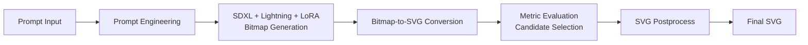

# Drawing with LLMs

一个面向 Kaggle **Drawing with LLMs** 的文本到 SVG 生成项目。  
该仓库将原始单文件 Notebook 重构为可维护、可扩展、可展示的工程化项目，核心逻辑保持一致。

## 项目目标

输入自然语言提示词，输出满足约束的 SVG 矢量图，核心流程包含：

1. Prompt 工程（前后缀 + 负面提示）
2. SDXL + Lightning + LoRA 位图生成
3. 位图到 SVG 的分层转换与压缩
4. 候选结果评分与择优
5. 最终 SVG 后处理并导出

## 技术亮点

- **生成侧优化**：SDXL + Lightning UNet（少步数快速推理）+ Vector 风格 LoRA
- **转换侧优化**：KMeans 量化、轮廓提取、重要性排序、多级多边形简化
- **约束感知**：在 SVG 字节预算内尽可能保留核心视觉信息
- **工程化重构**：Notebook 逻辑拆分为清晰模块 + 可复用 CLI 脚本
- **Kaggle 友好**：保留提交入口 `Model`，支持批量评估与提交文件导出

## Pipeline 结构



## 项目结构

```text
drawing-with-llms/
├── README.md
├── requirements.txt
├── .gitignore
├── notebooks/
│   └── sdxl-lora-original.ipynb
├── src/
│   └── drawing_llms/
│       ├── __init__.py
│       ├── config.py
│       ├── metrics.py
│       ├── evaluators.py
│       ├── model_loader.py
│       ├── bitmap_generator.py
│       ├── svg_converter.py
│       ├── pipeline.py
│       ├── postprocess.py
│       └── kaggle_model.py
├── scripts/
│   ├── run_single.py
│   ├── evaluate_train.py
│   └── export_submission.py
├── examples/
│   └── README.md
└── outputs/
    └── .gitkeep
```

## 核心模块说明

- `model_loader.py`：加载 SDXL、Lightning UNet、LoRA 及调度器
- `bitmap_generator.py`：文本提示到位图生成
- `svg_converter.py`：位图到 SVG 的主算法（特征提取/简化/预算控制）
- `evaluators.py`：评估器定义与初始化缓存
- `metrics.py`：SVG 渲染、评分封装、图像处理工具
- `pipeline.py`：完整多次尝试 + 评分择优流程
- `postprocess.py`：最终 SVG 细节修正
- `kaggle_model.py`：Kaggle 提交入口 `Model`

## 快速开始

### 1) 安装依赖

```bash
pip install -r requirements.txt
```

### 2) 单条 Prompt 生成

```bash
python scripts/run_single.py --prompt "a lighthouse overlooking the ocean"
```

默认输出：`outputs/single.svg`

### 3) 训练集批量评估

```bash
python scripts/evaluate_train.py --csv /path/to/train.csv --limit 20
```

默认输出：
- 评估结果：`outputs/train_eval_results.csv`
- 生成 SVG：`outputs/eval_svgs/`

### 4) 导出提交文件

```bash
python scripts/export_submission.py \
  --input-csv /path/to/test.csv \
  --output-csv outputs/submission.csv
```

## 配置建议

常用参数在 `kaggle_model.py` 与脚本参数中可调：

- `num_attempts_per_prompt`：每个 prompt 采样次数（质量 vs 时间）
- `num_inference_steps`：扩散步数（速度 vs 细节）
- `guidance_scale`：提示词约束强度
- `prompt_prefix / prompt_suffix / negative_prompt`：风格与质量引导

## 兼容性与限制

- 本项目保留了原 Notebook 的核心行为，不做大幅算法改写。
- 评估函数中 `VQAEvaluator` 目前为占位实现（返回 0），当前综合分数主要由 aesthetic 分数驱动。
- 模型下载依赖 Kaggle Hub；在本地运行时请确保网络和环境可用。

## 原始 Notebook

原始版本已保留在：

`notebooks/sdxl-lora-original.ipynb`

## 致谢

- Kaggle: Drawing with LLMs
- Stability AI (SDXL)
- SDXL Lightning / LoRA 社区模型作者
